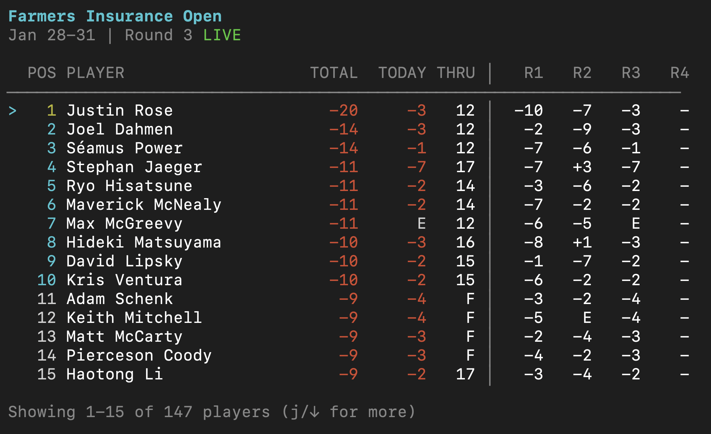
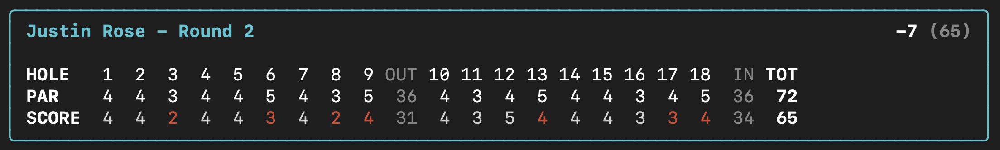
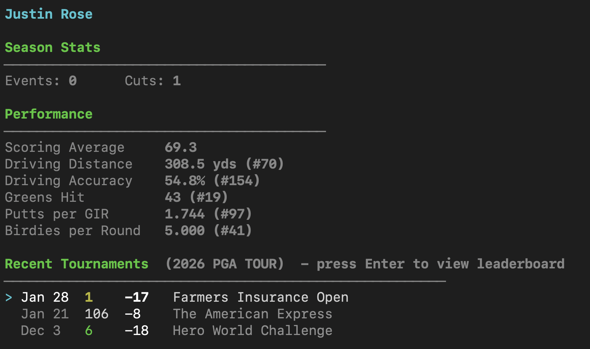

# golf-tui

A beautiful terminal UI for live professional golf leaderboards and player stats.

```
   ██████╗  ██████╗ ██╗     ███████╗
  ██╔════╝ ██╔═══██╗██║     ██╔════╝
  ██║  ███╗██║   ██║██║     █████╗  
  ██║   ██║██║   ██║██║     ██╔══╝  
  ╚██████╔╝╚██████╔╝███████╗██║     
   ╚═════╝  ╚═════╝ ╚══════╝╚═╝     
```

## Features

### Live Leaderboards
Real-time tournament scores from PGA Tour, LPGA, DP World Tour, and Champions Tour.



### Hole-by-Hole Scorecards
Detailed scorecards with red highlighting for birdies and eagles.



### Player Profiles
Detailed stats including scoring average, driving distance, greens hit, and recent results.



### More Features
- **Tournament History** - Drill into any past tournament to see the full leaderboard
- **Player Search** - Search for any golfer, whether they're playing this week or not
- **Breadcrumb Navigation** - Tab through the navigation path to quickly jump between views
- **Keyboard Navigation** - Fast, vim-style navigation throughout

## Installation

```bash
# Clone the repository
git clone https://github.com/athleticdevco/golf-tui.git
cd golf-tui

# Install dependencies
npm install

# Link globally (optional)
npm link
```

## Usage

```bash
# Run directly
npm start

# Or if linked globally
golf
```

## Keyboard Shortcuts

### Leaderboard View
| Key | Action |
|-----|--------|
| `j` / `↓` | Move down |
| `k` / `↑` | Move up |
| `Enter` | View player profile |
| `c` | View player scorecard |
| `Tab` | Switch tour (PGA → LPGA → DP World → Champions) |
| `s` | Search players |
| `r` | Refresh data |
| `q` | Quit |

### Scorecard View
| Key | Action |
|-----|--------|
| `1-4` | Switch round |
| `Tab` | Navigate breadcrumb |
| `Esc` | Go back |

### Player Profile
| Key | Action |
|-----|--------|
| `j` / `↓` | Navigate recent results |
| `k` / `↑` | Navigate recent results |
| `Enter` | View tournament leaderboard |
| `Tab` | Navigate breadcrumb |
| `Esc` | Go back |

### Event Leaderboard
| Key | Action |
|-----|--------|
| `j` / `↓` | Move down |
| `k` / `↑` | Move up |
| `Enter` | View player profile |
| `c` | View player scorecard |
| `Tab` | Navigate breadcrumb |
| `Esc` | Go back |

### Search
| Key | Action |
|-----|--------|
| `↓` / `↑` | Navigate results |
| `Enter` | Select player |
| `Esc` | Cancel search |

### Commands
Type `/` to open the command palette:
- `/leaderboard` - View live tournament leaderboard
- `/schedule` - View tournament schedule
- `/pga` - Switch to PGA Tour
- `/lpga` - Switch to LPGA Tour
- `/eur` - Switch to DP World Tour
- `/champions` - Switch to Champions Tour
- `/help` - Show keyboard shortcuts

## Tech Stack

- [React](https://reactjs.org/) + [Ink](https://github.com/vadimdemedes/ink) - Terminal UI framework
- [TypeScript](https://www.typescriptlang.org/) - Type safety

## Data Source

This app uses ESPN's public (undocumented) API for live golf data. Special thanks to [pseudo-r/Public-ESPN-API](https://github.com/pseudo-r/Public-ESPN-API) for documenting the available endpoints.

**Note:** This is an unofficial app and is not affiliated with ESPN. Data is provided for personal use only.

## License

MIT
